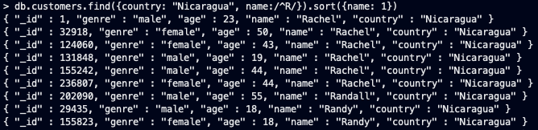
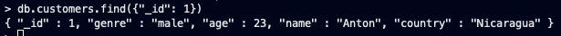
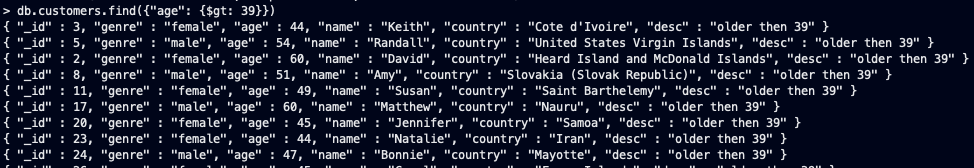
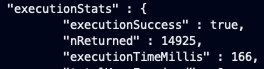
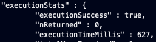
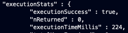
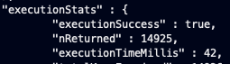
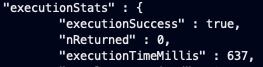
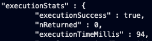

Работа проводилась в оболочке _mongo shell_ на тестовой коллекции с 250000 документов, вида:
```json
{
  "_id" : 1, 
  "genre" : "male",
  "age" : 23, 
  "name" : "Rachel",
  "country" : "Nicaragua"
}
```
# Подготовка
___
Запускаем docker container MongoDB, копируем наш датасет и создаем из него коллекцию MongoDB
```shell
docker container run --rm --name mongodb -d mongo
docker container cp otus_no_sql/hw2/mng_sample.csv mongodb:/tmp
docker container exec -it mongodb bash
mongoimport -d mydb -c things --type csv --file /tmp/m.csv --headerline
mongo
use test
```

# Выборка данных
___
* Выберем всех людей с именем начинающимся на R, проживающих в Nicaragua
```shell
db.customers.find({country: "Nicaragua", name:/^R/}).sort({name: 1})
```



* Посчитаем средний возраст людей в каждой стране и выведем только результаты выше 40 (аналог group by, having в sql)
```shell
db.customers.aggregate([ {$group : {_id : "$country", avg_age : {$avg: "$age" }}}, {$match: { avg_age: { $gte: 40} }} ])
```

___

# Обновление данных
___
* обновим человеку с id=1 имя
```shell
db.customers.update({"_id" : 1}, {$set: {"name": "Anton"}})
```

* добавим всем людям старше 39 лет дополнительное поле
```shell
db.customers.update({"age": {$gt : 39}}, {$set: {"desc": "older then 39"}}, {multi: true})
```

___
# Индексы
___
Для начала возьмем 3 запроса и посмотрим с помощью команды explain("executionStats") их время выполнения:
* выборка людей с именем начинающимся на R
```shell
db.customers.explain("executionStats").find({name:/^R/}).sort({name: 1})
```

* обновление имен всех людей старше 30 лет
```shell
db.customers.explain("executionStats").update({age: {$gt: 30}}, {$set: {"name": "NewName"}}, {multi: true})
```

* обновление имен всех людей начинающихся на R
```shell
db.customers.explain("executionStats").update({name:/^R/}, {$set: {"name": "NewName"}}, {multi: true})
```


создаем индекс по полю name
```shell
db.customers.createIndex({ name: 1 })
```
И теперь снова сделаем explain и сравним результаты:

```shell
db.customers.explain("executionStats").find({name:/^R/}).sort({name: 1})
```

```shell
db.customers.explain("executionStats").update({age: {$gt: 30}}, {$set: {"name": "NewName"}}, {multi: true})
```

```shell
db.customers.explain("executionStats").update({name:/^R/}, {$set: {"name": "NewName"}}, {multi: true})
```


Как видно из результатов, после создания индекса запросы с выборкой (обновлением) данных по индексируемому полю стали значительно быстрее
А обновление с условием по не индексированному полю, происходит практически за то же самое время
